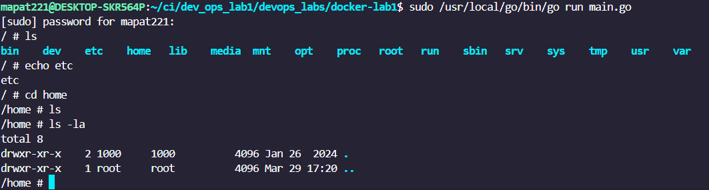

# Лабораторная работа 1

## Ход работы

### Конфигурация

Для начала нужно было создать конфиг, который утилита считает и поймет, какие неймспейсы нам нужны,
что ставить хостом, и что исполнять, ну в моем случае - запускать оболочку 

Сам конфиг не трудно украсть с крутого [примера](https://github.com/opencontainers/runtime-spec/blob/main/config.md#configuration-schema-example)

Ну и упростить конечно, изоляции по pid, uts, mount условно хватит

Вышло вот такое:


```json
{
    "ociVersion": "1.0.1",
    "id": "cfgHrafda3",
    "hostname": "alpine",
    "process": {
        "args": ["/bin/sh"
        ],
        "cwd": "/"
    },
    "root": {
        "path": "alpine"
    },
    "linux": {
        "namespaces": [
            {
                "type": "pid"
            },
            {
                "type": "uts"
            },
            {
                "type": "mount"
            }
        ]
    }


}
```

### Папка для псевдо ОС

Ну тут не сложно, просто ставим базовые пакеты ос alpine, остальное не надо, ядро у нас будет использоваться с хостовой ОС

### Код

1. Для начала заанмаршелил конфиг, чтобы можно было создать директории под будущую изоляцию

```go
json.Unmarshal(file, &config)
```

2. Дальше соответственно создание самих директорий и вызов функцией main программы еще раз

```go
baseDir := filepath.Join("/var/lib", "docker-lab", config.ID)
upperDir := filepath.Join(baseDir, "upper")
workDir := filepath.Join(baseDir, "work")
mergedDir := filepath.Join(baseDir, "merged")
	
err = os.MkdirAll(baseDir, 0755)
....
cmd := exec.Command("/proc/self/exe", "child")
	cmd.Stdin = os.Stdin
	cmd.Stdout = os.Stdout
	cmd.Stderr = os.Stderr

	cmd.SysProcAttr = &syscall.SysProcAttr{
		Cloneflags: syscall.CLONE_NEWPID | syscall.CLONE_NEWNS | syscall.CLONE_NEWUTS,
	}
```
3. А как вызывать саму изоляцию, поняв, что окружение настроено?

И вот тут самое интересное, мы передаем склоненый флаги в дочернюю программу от самой себя и вызываем ее, но передаем
в аргументы слово "child"

Теперь срабатывает эта проверка на входе в main

```go
if len(os.Args) > 1 && os.Args[1] == "child" {
		runContainer()
		return
	}
```

Вызывается функция runContainer(), которая уже и займется контеризацией

4. Запуск контейнера

Внутри нам надо заново прочитать конфиг, т.к. дочерний процесс о том, что директории для маунта уже есть не знает

```go
json.Unmarshal(file, &config)

	baseDir := filepath.Join("/var/lib", "docker-lab", config.ID)
	upperDir := filepath.Join(baseDir, "upper")
	workDir := filepath.Join(baseDir, "work")
	mergedDir := filepath.Join(baseDir, "merged")
	lowerDir, _ := filepath.Abs(config.Root.Path)
```

А дальше просто изолируем процесс и меняем хост

```go
syscall.Mount("", "/", "", syscall.MS_PRIVATE|syscall.MS_REC, "")
syscall.Sethostname([]byte(config.Hostname))
mountOptions := fmt.Sprintf("lowerdir=%s,upperdir=%s,workdir=%s", lowerDir, upperDir, workDir)
syscall.Mount("overlay", mergedDir, "overlay", 0, mountOptions)
```

Ну и финалочка, меняем корневой каталог и рабочую директорию + запускаем оболочку

```go
syscall.Chroot(mergedDir)
os.Chdir(config.Process.Cwd)
syscall.Exec(config.Process.Args[0], config.Process.Args, os.Environ())
```

Все, теперь у нас запущена шелл оболочка apline внутри изолированного пространства, в ней даже можно исполнять команды,
хотя скорее естественно можно

Ну сама alpine только не закомитилась из-за судо, но вот крутой скрин



4. Сложности

2 часа чинил форматер голанга, чтобы узнать, что надо было обновить VScode и зашатдаунить wsl после этого