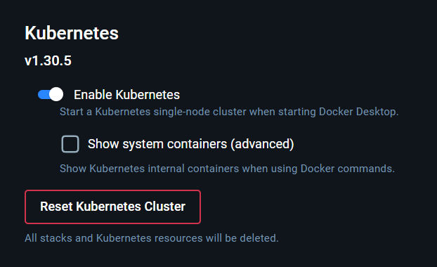
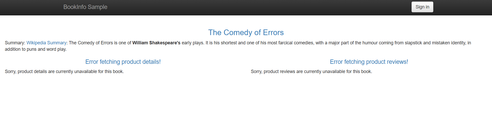

# Лабораторная работа 2

## Ход работы

1. Для начала подготовим docker desktop для работы с kubernetes



2. Ставим `kubectl` и `istioctl`

3. Разворачиваем Control panel

```bash
istioctl install --set profile=demo -y
```

4. Подключение сервиса к mesh

Включаем автоматическое внедрение прокси, чтобы перехватывать создание кубами пода, встраивать туда второй контейнер
Envoy proxy и пускать весь сетевой трафик через него

```bash
kubectl label namespace default istio-injection=enabled
```

5. Межсервисное взаимодействие

Благо есть эталонный семпл для тестов

`https://istio.io/latest/docs/examples/microservices-istio/bookinfo-kubernetes/`

```bash
kubectl apply -f samples/bookinfo/platform/kube/bookinfo.yaml
```

Смотрим поды

```bash
kubectl get pods
```

```bash
NAME                              READY   STATUS    RESTARTS   AGE
details-v1-64bcb758dc-msnxz       2/2     Running   0          17s
productpage-v1-78787b7cdd-l8fhr   2/2     Running   0          17s
ratings-v1-86bdf4c6c-rdjxl        2/2     Running   0          17s
reviews-v1-867dd8b5b9-ldkhl       2/2     Running   0          17s
reviews-v2-b4c897c97-7x2st        2/2     Running   0          17s
reviews-v3-76f7b975d5-4qsbz       2/2     Running   0          17s
```

6. Настраиваем доступ извне

Конфигурация шлюза

```bash
kubectl apply -f samples/bookinfo/networking/bookinfo-gateway.yaml
```


7. Размечаем версии микросервисов c помощью destination-rule конфига

```bash
kubectl apply -f samples/bookinfo/networking/destination-rule-all.yaml
```

8. Применяем правило маршрутизации

Перенаправляем 100% трафика для всех сервисов только на версии v1

```
kubectl apply -f samples/bookinfo/networking/virtual-service-all-v1.yaml
```



 Звезды рейтинга больше не отображаются, так как трафик на v2 и v3 полностью перекрыт на уровне сети

 9. Ставим системы мониторинга

 ```bash
 kubectl apply -f samples/addons
 ```

 10. Смотрим топологию сети kiali и трассировку каждого запроса через все микросервисы с помощью Jaeger

 ```bash
 istioctl dashboard kiali
 ```

 ```bash
 istioctl dashboard jaeger
 ```

 11. Безопасность на основе mTLS

 Создаем конфиг и применяем правила

 ```bash
 kubectl apply -f securityconfig.yaml
 ```

Теперь между сервисами используется протокол общения mTLS

## Сложности

Скрины перестали вставляться в VScode при ctrl + V, пришлось 300 костылей использовать