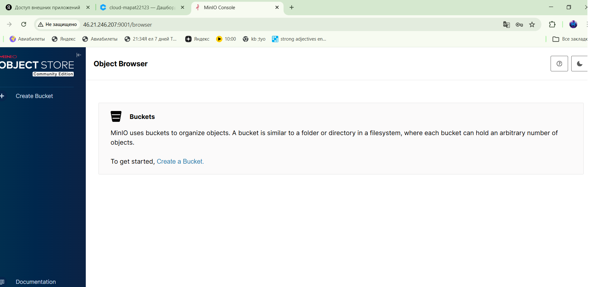

# Лабораторная работа №3 - Облако

1. Ставим ansible 

```bash
sudo apt install software-properties-common -y
sudo apt-add-repository --yes --update ppa:ansible/ansible
sudo apt install ansible -y
```
2. Ставим terraform для создания виртаульной машины

```bash
wget https://releases.hashicorp.com/terraform/1.5.7/terraform_1.5.7_linux_amd64.zip
unzip terraform_1.5.7_linux_amd64.zip
sudo mv terraform /usr/local/bin/
```

3. Создаем ssh ключ для сервака

```bash
ssh-keygen -t rsa -b 4096 -C "maratnazmeve@gmail.com"
```

4.Будем использовать облако Яндекса

```bash
nano main.tf
```

```
terraform {
  required_providers {
    yandex = {
      source = "yandex-cloud/yandex"
    }
  }
}

provider "yandex" {
  token     = "token"
  cloud_id  = "cloud_id"
  folder_id = "folder id"
  zone      = "ru-central1-a"
}

# Сеть
resource "yandex_vpc_network" "lab-network" {
  name = "lab-network"
}

# Подсеть
resource "yandex_vpc_subnet" "lab-subnet" {
  name           = "lab-subnet"
  zone           = "ru-central1-a"
  network_id     = yandex_vpc_network.lab-network.id
  v4_cidr_blocks = ["192.168.10.0/24"]
}

# Берем Ubuntu
data "yandex_compute_image" "ubuntu" {
  family = "ubuntu-2204-lts"
}

# Сама ВМ
resource "yandex_compute_instance" "minio-server" {
  name        = "minio-server"
  platform_id = "standard-v3"
  zone        = "ru-central1-a"

  resources {
    cores  = 2
    memory = 2
  }

  boot_disk {
    initialize_params {
      image_id = data.yandex_compute_image.ubuntu.id
      size     = 10
    }
  }

  network_interface {
    subnet_id = yandex_vpc_subnet.lab-subnet.id
    nat       = true
  }

  metadata = {
    ssh-keys = "ubuntu:${file("~/.ssh/id_rsa.pub")}"
  }
}

# IP вмки
output "external_ip" {
  value = yandex_compute_instance.minio-server.network_interface.0.nat_ip_address
}
```

```bash
terraform init
```

```bash
terraform apply -auto-approve
```

```
Apply complete! Resources: 1 added, 0 changed, 0 destroyed.

Outputs:

external_ip = "46.21.246.207"
```

5. Ставим MinIO и пишем плейбук

```bash
nano invetory.ini
```

```
[minio]
46.21.246.207 ansible_user=ubuntu ansible_ssh_common_args='-o StrictHostKeyChecking=no'
```

```yml
- name: Install and configure MinIO
  hosts: minio
  become: yes # От рута
  tasks:
    - name: Download MinIO server binary
      get_url:
        url: https://dl.min.io/server/minio/release/linux-amd64/minio
        dest: /usr/local/bin/minio
        mode: '0755' # Права на исполнение

    - name: Create MinIO data directory
      file:
        path: /data
        state: directory

    - name: Create systemd service file for MinIO
      copy:
        dest: /etc/systemd/system/minio.service
        content: |
          [Unit]
          Description=MinIO
          [Service]
          Environment="MINIO_ROOT_USER=admin"
          Environment="MINIO_ROOT_PASSWORD=meme"
          ExecStart=/usr/local/bin/minio server /data --console-address ":9001"
          Restart=always
          [Install]
          WantedBy=multi-user.target

    - name: Start and enable MinIO service
      systemd:
        name: minio
        state: started
        enabled: yes
        daemon_reload: yes
```

```bash
ansible-playbook -i inventory.ini playbook.yml
```

```
PLAY [Install and configure MinIO] *************************************************************************************************

TASK [Gathering Facts] *************************************************************************************************************
[WARNING]: Platform linux on host 46.21.246.207 is using the discovered Python interpreter at /usr/bin/python3.10, but future
installation of another Python interpreter could change the meaning of that path. See https://docs.ansible.com/ansible-
core/2.17/reference_appendices/interpreter_discovery.html for more information.
ok: [46.21.246.207]

TASK [Download MinIO server binary] ************************************************************************************************
changed: [46.21.246.207]

TASK [Create MinIO data directory] *************************************************************************************************
changed: [46.21.246.207]

TASK [Create systemd service file for MinIO] ***************************************************************************************
changed: [46.21.246.207]

TASK [Start and enable MinIO service] **********************************************************************************************
changed: [46.21.246.207]

PLAY RECAP *************************************************************************************************************************
46.21.246.207              : ok=5    changed=4    unreachable=0    failed=0    skipped=0    rescued=0    ignored=0 
```

6. Тест



7. Постпроцессинг

Рельные креды я убрал

Хэши, серты, ключи, токены и прочее тоже

8. Сложности

Только с тем, чтобы карту привязать к облаку и скачать terraform со сломанным dns на wsl