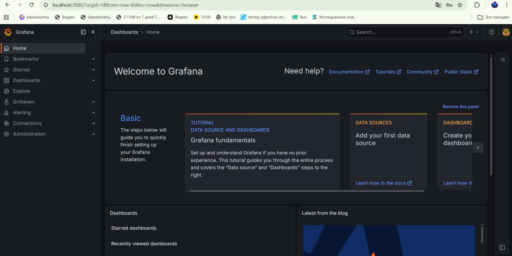
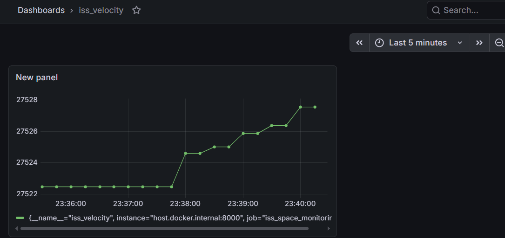
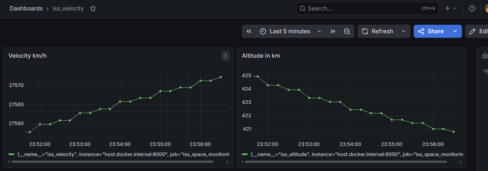

# Лабораторная работа №5 - Monitoring 

## Api для запросов

Будем использовать api wheretheiss для получения положения МКС

`https://api.wheretheiss.at/v1/satellites/25544`

Get-запрос на эндпоинт выше возвращает json следующего формата:

```json
{
  "name": "iss",
  "id": 25544,
  "latitude": 14.004182584634,
  "longitude": 22.90376561066,
  "altitude": 414.5110604223,
  "velocity": 27600.542084581,
  "visibility": "eclipsed",
  "footprint": 4479.4321085114,
  "timestamp": 1780252288,
  "daynum": 2461192.2718519,
  "solar_lat": 21.995261686,
  "solar_lon": 261.56984837358,
  "units": "kilometers"
}
```
Нас интересует скорость и высота станции

## Парсер

Для парсинга ответа используем локально поднятый на порту 8000 экспортер, который будет давать запрос
на api каждые 30 секунд, доставать из ответа скорость и высоту, а затем передавать их в прометеус

```python
import time
import requests
from prometheus_client import start_http_server, Gauge

ISS_VELOCITY = Gauge('iss_velocity', 'Current velocity of the ISS in km/h')
ISS_ALTITUDE = Gauge('iss_altitude', 'Current altitude of the ISS in km')

def get_iss_data():
    try:
        response = requests.get("https://api.wheretheiss.at/v1/satellites/25544", timeout=30)
        data = response.json()
        velocity = data['velocity']
        altitude = data['altitude']
        ISS_VELOCITY.set(velocity)
        ISS_ALTITUDE.set(altitude)
        print(f"fetched data. Velocity: {velocity}, altitude: {altitude}")
    except Exception as e:
        print(f"Request error: {e}")

if __name__ == '__main__':
    start_http_server(8000)
    while True:
        get_iss_data()
        time.sleep(30)
```

Работает

```
fetched data. Velocity: 27539.181171371, altitude: 434.08306162654
fetched data. Velocity: 27538.181979537, altitude: 434.47408182433
fetched data. Velocity: 27537.302287009, altitude: 434.81826339227
fetched data. Velocity: 27536.441877279, altitude: 435.15472067471
fetched data. Velocity: 27535.555356872, altitude: 435.50107668521
fetched data. Velocity: 27534.781672972, altitude: 435.80297704171
fetched data. Velocity: 27534.11478047, altitude: 436.06284014875
```

## Прометеус и графана

Конфиг прометеуса

```yml
global:
  scrape_interval: 30s # Забираем данные каждые 30 секунд

scrape_configs:
  - job_name: 'iss_space_monitoring'
    static_configs:
      - targets: ['host.docker.internal:8080']
```

Докер компоуз для них

```yml
version: '3.8'

services:
  prometheus:
    image: prom/prometheus:latest
    container_name: prometheus_container
    volumes:
      - ./prom_config.yml:/etc/prometheus/prometheus.yml
    ports:
      - "9090:9090"
    extra_hosts:
      - "host.docker.internal:host-gateway"
  grafana:
    image: grafana/grafana:latest
    container_name: grafana_container
    ports:
      - "3000:3000"
    environment:
      - GF_SECURITY_ADMIN_PASSWORD=123456
```

Запускаем

```bash
sudo docker-compose up -d
```

```bash
WARN[0000] /home/mapat221/ci/devops_labs/docker-lab5/docker-compose.yml: the attribute `version` is obsolete, it will be ignored, please remove it to avoid potential confusion 
[+] Running 25/15
 ✔ grafana Pulled                                                                                              510.3s 
 ✔ prometheus Pulled      
```

## Настраиваем графану

идем на `http://localhost:3000` и логинимся в графану



Идем на Connections -> Data Sources -> Add data source

Выбираем Prometheus и выставляем в Prometheus server URL `http://prometheus_container:9090`


Далее идем Dashboards -> New -> New Dashboard

Создаем панель с истоником prometheus и метрикой iss_velocity

запускаем парсер

```python
python3 parser.py
fetched data. Velocity: 27528.845179347, altitude: 438.09885435937
fetched data. Velocity: 27528.151882086, altitude: 438.35971922475
```

Победа



Добавляем еще и график высоты



## Сложности

Не возникало :D